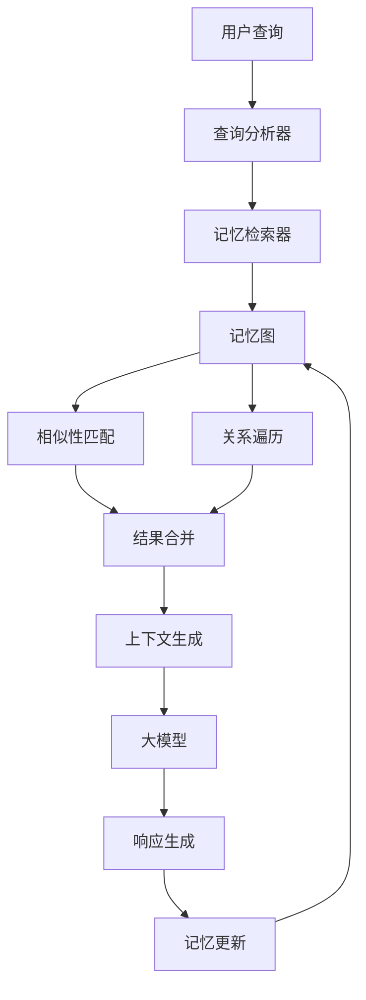

# LLM Memory 架构设计文档

## 整体架构

### 1. 分层架构设计

```
┌─────────────────────────────────────────────────────────────┐
│                      应用层 (Application Layer)              │
│  ┌─────────────────────────────────────────────────────────┐ │
│  │              大参数模型接口                               │ │
│  │        (GPT-4, Claude, Gemini, etc.)                    │ │
│  └─────────────────────────────────────────────────────────┘ │
└─────────────────────┬───────────────────────────────────────┘
                      │
┌─────────────────────▼───────────────────────────────────────┐
│                    服务层 (Service Layer)                   │
│  ┌─────────────────────────────────────────────────────────┐ │
│  │            SmallModelMemoryAssistant                     │ │
│  │  ┌─────────────┐ ┌─────────────┐ ┌─────────────┐       │ │
│  │  │  查询分析   │ │  记忆检索   │ │  内容处理   │       │ │
│  │  │QueryAnalyzer│ │MemoryRetrieval│ContentProcessor│   │ │
│  │  └─────────────┘ └─────────────┘ └─────────────┘       │ │
│  │  ┌─────────────┐ ┌─────────────┐ ┌─────────────┐       │ │
│  │  │  关系分析   │ │  重要性评估 │ │  优化建议   │       │ │
│  │  │RelationAnalyzer│ImportanceEvaluator│Optimizer│     │ │
│  │  └─────────────┘ └─────────────┘ └─────────────┘       │ │
│  └─────────────────────────────────────────────────────────┘ │
└─────────────────────┬───────────────────────────────────────┘
                      │
┌─────────────────────▼───────────────────────────────────────┐
│                    核心层 (Core Layer)                      │
│  ┌─────────────────────────────────────────────────────────┐ │
│  │                  MemoryGraph                             │ │
│  │  ┌─────────────┐ ┌─────────────┐ ┌─────────────┐       │ │
│  │  │ MemoryNode  │ │MemoryRelation│ │ GraphEngine │       │ │
│  │  │  - 内容     │ │  - 关系类型 │ │  - JGraphT  │       │ │
│  │  │  - 嵌入     │ │  - 权重     │ │  - 算法     │       │ │
│  │  │  - 元数据   │ │  - 衰减     │ │  - 遍历     │       │ │
│  │  └─────────────┘ └─────────────┘ └─────────────┘       │ │
│  └─────────────────────────────────────────────────────────┘ │
└─────────────────────┬───────────────────────────────────────┘
                      │
┌─────────────────────▼───────────────────────────────────────┐
│                   存储层 (Storage Layer)                    │
│  ┌─────────────┐ ┌─────────────┐ ┌─────────────┐           │
│  │   向量存储  │ │   图存储    │ │   缓存存储  │           │
│  │  Qdrant     │ │   Neo4j     │ │  EhCache    │           │
│  │  Pinecone   │ │   H2        │ │  Redis      │           │
│  │  Weaviate   │ │   SQLite    │ │  Memory     │           │
│  └─────────────┘ └─────────────┘ └─────────────┘           │
└─────────────────────────────────────────────────────────────┘
```

### 2. 数据流架构



## 核心组件详细设计

### 1. MemoryNode 设计

#### 数据结构
```kotlin
data class MemoryNode(
    val id: String,                    // 唯一标识符
    val content: String,               // 内容文本
    val contentType: ContentType,      // 内容类型
    val embedding: List<Float>,        // 向量嵌入
    val metadata: Map<String, String>, // 元数据
    val createdAt: Long,              // 创建时间
    val lastAccessedAt: Long,         // 最后访问时间
    val accessCount: Int,             // 访问次数
    val importance: Float,            // 重要性分数
    val tags: Set<String>             // 标签集合
)
```

#### 重要性计算算法
```
importance(t) = base_importance × time_decay(t) × access_boost(t)

其中:
- base_importance: 基础重要性 (0.0 - 1.0)
- time_decay(t) = exp(-days_since_creation × decay_rate)
- access_boost(t) = min(access_count × boost_factor, max_boost)
```

#### 生命周期管理
1. **创建阶段**: 初始化基础重要性和元数据
2. **活跃阶段**: 频繁访问，重要性增强
3. **衰减阶段**: 访问减少，重要性下降
4. **清理阶段**: 重要性低于阈值，候选删除

### 2. MemoryRelation 设计

#### 关系类型分类
```kotlin
enum class RelationType {
    // 语义关系 (Semantic Relations)
    SIMILAR,        // 相似关系
    OPPOSITE,       // 相反关系
    SYNONYM,        // 同义关系
    ANTONYM,        // 反义关系
    
    // 层次关系 (Hierarchical Relations)
    IS_A,           // 类属关系
    PART_OF,        // 部分关系
    CONTAINS,       // 包含关系
    INSTANCE_OF,    // 实例关系
    
    // 逻辑关系 (Logical Relations)
    CAUSES,         // 因果关系
    IMPLIES,        // 蕴含关系
    CONFLICTS,      // 冲突关系
    SUPPORTS,       // 支持关系
    
    // 时序关系 (Temporal Relations)
    BEFORE,         // 先于关系
    AFTER,          // 后于关系
    DURING,         // 期间关系
    OVERLAPS,       // 重叠关系
    
    // 上下文关系 (Contextual Relations)
    CONTEXT,        // 上下文关系
    EXAMPLE,        // 示例关系
    REFERENCE,      // 引用关系
    DEPENDENCY      // 依赖关系
}
```

#### 关系强度计算
```
strength(t) = base_strength × reinforcement_factor × time_decay(t)

其中:
- base_strength: 初始强度 (0.0 - 1.0)
- reinforcement_factor = 1 + (reinforcement_count × reinforcement_rate)
- time_decay(t) = exp(-days_since_last_reinforcement × decay_rate)
```

### 3. MemoryGraph 设计

#### 图结构选择
- **库选择**: JGraphT (Java Graph Theory Library)
- **图类型**: 有向加权图 (DirectedWeightedGraph)
- **节点**: MemoryNode ID 字符串
- **边**: MemoryRelation 对象

#### 核心算法

##### 相似性检索算法
```kotlin
fun findSimilarNodes(queryEmbedding: List<Float>): List<SimilarityResult> {
    return nodes.parallelStream()
        .map { node -> 
            val similarity = cosineSimilarity(queryEmbedding, node.embedding)
            SimilarityResult(node, similarity)
        }
        .filter { it.similarity >= threshold }
        .sorted { a, b -> b.similarity.compareTo(a.similarity) }
        .limit(maxResults)
        .collect(toList())
}
```

##### 关系遍历算法
```kotlin
fun findRelatedNodes(startNodeId: String, maxDepth: Int): List<RelatedNode> {
    val visited = mutableSetOf<String>()
    val queue = ArrayDeque<Pair<String, Int>>()
    val results = mutableListOf<RelatedNode>()
    
    queue.offer(startNodeId to 0)
    
    while (queue.isNotEmpty()) {
        val (nodeId, depth) = queue.poll()
        
        if (nodeId in visited || depth > maxDepth) continue
        visited.add(nodeId)
        
        if (depth > 0) {
            results.add(RelatedNode(nodes[nodeId]!!, depth))
        }
        
        if (depth < maxDepth) {
            graph.outgoingEdgesOf(nodeId).forEach { edge ->
                val targetId = graph.getEdgeTarget(edge)
                val weight = graph.getEdgeWeight(edge)
                if (weight >= minWeight && targetId !in visited) {
                    queue.offer(targetId to depth + 1)
                }
            }
        }
    }
    
    return results
}
```

### 4. SmallModelMemoryAssistant 设计

#### 查询分析模块
```kotlin
class QueryAnalyzer {
    suspend fun analyzeQuery(query: String): QueryAnalysis {
        val keywords = extractKeywords(query)
        val intent = classifyIntent(query)
        val complexity = calculateComplexity(query)
        val concepts = extractConcepts(query)
        
        return QueryAnalysis(
            keywords = keywords,
            intent = intent,
            complexity = complexity,
            concepts = concepts
        )
    }
}
```

#### 记忆检索模块
```kotlin
class MemoryRetriever {
    suspend fun retrieveRelevantMemories(
        query: QueryAnalysis,
        maxResults: Int = 10
    ): List<RetrievalResult> {
        // 1. 向量相似性检索
        val vectorResults = findByVectorSimilarity(query.embedding)
        
        // 2. 关键词匹配检索
        val keywordResults = findByKeywords(query.keywords)
        
        // 3. 概念匹配检索
        val conceptResults = findByConcepts(query.concepts)
        
        // 4. 结果合并和排序
        return mergeAndRankResults(vectorResults, keywordResults, conceptResults)
    }
}
```

## 性能优化策略

### 1. 内存管理
- **对象池**: 复用频繁创建的对象
- **懒加载**: 按需加载记忆内容
- **分页加载**: 大规模数据分批处理
- **内存监控**: 实时监控内存使用情况

### 2. 计算优化
- **并行计算**: 利用多核处理器并行处理
- **缓存机制**: 缓存频繁访问的计算结果
- **索引优化**: 为关键查询建立索引
- **算法优化**: 使用高效的数据结构和算法

### 3. 存储优化
- **压缩存储**: 压缩向量数据减少存储空间
- **分层存储**: 热数据内存，冷数据磁盘
- **批量操作**: 批量读写减少I/O开销
- **异步处理**: 异步持久化避免阻塞

### 4. 网络优化
- **连接池**: 复用数据库连接
- **数据压缩**: 压缩网络传输数据
- **本地缓存**: 减少网络请求
- **CDN加速**: 静态资源CDN分发

## 扩展性设计

### 1. 水平扩展
- **图分片**: 将大图分割到多个节点
- **负载均衡**: 均匀分配查询请求
- **数据同步**: 保持分片间数据一致性
- **故障恢复**: 节点故障时的数据恢复

### 2. 垂直扩展
- **资源隔离**: CPU、内存、存储分离
- **专用硬件**: GPU加速向量计算
- **SSD加速**: 高速存储提升I/O性能
- **内存扩展**: 增加内存容量

### 3. 功能扩展
- **插件系统**: 支持自定义扩展
- **API标准**: 标准化的接口规范
- **配置管理**: 灵活的配置系统
- **监控指标**: 完善的监控体系

## 安全性考虑

### 1. 数据安全
- **加密存储**: 敏感数据加密保存
- **访问控制**: 基于角色的权限控制
- **数据脱敏**: 敏感信息脱敏处理
- **审计日志**: 记录所有操作日志

### 2. 系统安全
- **输入验证**: 严格验证所有输入
- **SQL注入防护**: 防止SQL注入攻击
- **XSS防护**: 防止跨站脚本攻击
- **CSRF防护**: 防止跨站请求伪造

### 3. 隐私保护
- **数据匿名化**: 去除个人身份信息
- **最小化原则**: 只收集必要的数据
- **保留期限**: 定期删除过期数据
- **用户控制**: 用户可控制自己的数据

## 监控和运维

### 1. 性能监控
- **响应时间**: 查询响应时间统计
- **吞吐量**: 每秒处理请求数
- **资源使用**: CPU、内存、磁盘使用率
- **错误率**: 错误请求比例

### 2. 业务监控
- **记忆质量**: 记忆准确性和相关性
- **用户满意度**: 用户反馈和评分
- **系统健康度**: 整体系统状态评估
- **数据一致性**: 数据完整性检查

### 3. 告警机制
- **阈值告警**: 关键指标超过阈值时告警
- **异常检测**: 检测异常模式并告警
- **故障预警**: 预测潜在故障并预警
- **自动恢复**: 自动处理常见故障

---

本架构设计文档将随着项目的发展不断更新和完善。